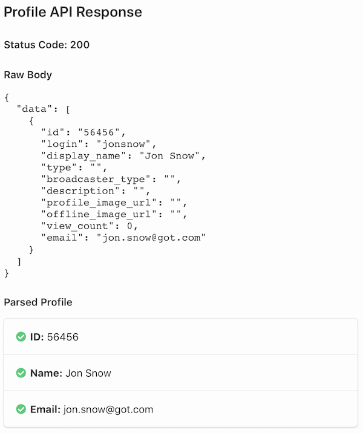

OAuth is an open standard for authentication and authorization. Fider is an OAuth client that can connect to any OAuth2 provider to enable a fast, easy and secure sign in process.

Fider has native support for Facebook, Google and GitHub. On a self-hosted instance these are configured with environment variables (see [Common Providers](#oauth-common-providers)).
Once configured, they are enabled on your site, and administrators can switch each of them on or off in **Site Settings -> Authentication**.
To add any other OAuth provider please follow this guide.

### Registering a new OAuth Provider

While logged in as an Administrator, navigate to **Site Settings -> Authentication**.

This page lists all registered providers, either Enabled or Disabled. To register a new provider, click **Add new** and fill the form with all the required information. If you're new to OAuth, we've prepared a [list of how to configure the most common providers](#oauth-common-providers).

#### Form fields

- **Display Name** (required): the text shown on the sign in button, less than 50 characters. A **Button Preview** is shown next to it.
- **Logo** (optional): the icon shown on the sign in button. It must be a JPG, GIF or PNG image, smaller than 50KB, square, and at least 24x24 pixels.
- **Client ID** and **Client Secret** (required): given by your OAuth provider. Once saved, the secret is hidden; click **change** to replace it.
- **Authorize URL** (required): the page of your provider where users are sent to sign in.
- **Token URL** (required): the URL Fider calls to exchange the authorization code for an access token.
- **Scope** (required): the scopes to request, separated by spaces. Only request what's needed to read the user's ID, name and email.
- **Profile API URL** (optional): the URL Fider calls, with the access token as a `Bearer` token, to get the user's profile as JSON.
  If empty, Fider reads the user info from the access token itself, which must then be a JWT.
- **JSON Path** fields: which parts of the profile to use for the user's ID, Name, Email and Roles. See [Configuring the JSON paths](#configuring-the-json-paths).
- **Allowed Roles** (optional): see [Restricting sign in by role](#restricting-sign-in-by-role).
- **Trusted Source**: this only applies to private sites. If enabled, users who sign in with this provider can access your site without being invited.
  This is recommended for corporate providers, such as Okta, Microsoft Entra ID or Google Workspace. Do not use it for public identity providers.
- **Status**: when enabled, the provider is shown to everyone on the sign in page. Keep it disabled until you have [tested](#oauth-testing) it.
  You can't disable the last enabled provider while email authentication is disabled.

#### Callback URL

After saving, the provider is listed with its **Client ID** and **Callback URL**. The callback URL looks like `https://<your-fider-site>/oauth/_abcdefghij/callback`,
where `_abcdefghij` is a random key generated when the provider is created. Register this URL as the redirect (or callback) URL in your OAuth provider.

On sites hosted by fider.io, or self-hosted in [multi-tenant mode](/multi-tenant), the callback URL uses the `login` subdomain instead. Always copy it from the list.

#### Private network addresses {#private-network-addresses}

Fider's server calls the **Token URL** and the **Profile API URL** itself. To protect your network, these requests are blocked when the URL points to a
private or internal network address, such as `localhost`, `127.0.0.1`, `10.x.x.x`, `172.16.x.x` to `172.31.x.x`, `192.168.x.x`, `169.254.x.x`, or a
host name that resolves to one of them (for example another container on the same Docker network). The **Authorize URL** is not affected, as it's opened by
the user's browser.

The check runs during sign in and when you test the provider, not when you save it. A blocked URL shows an error such as
_Token URL is not allowed: This URL is not allowed because it targets a private or internal network address._

If you self-host your identity provider (for example Keycloak or Authentik) on your own network, set the environment variable
`ALLOW_PRIVATE_NETWORK_TARGETS=true` (available since v0.36.1). This also allows Webhooks to target internal addresses. See the
[configuration reference](/hosting-instance#configuration-reference).

By default, the token and profile requests of custom providers are sent directly: `HTTP_PROXY` and `HTTPS_PROXY` are ignored and redirects are not followed.
Setting `ALLOW_PRIVATE_NETWORK_TARGETS=true` also makes them use your proxy settings.

### Configuring the JSON paths

The JSON path tells Fider which bits of the JSON profile to extract for the ID, Name, Email and Roles fields.

Here's an example JSON response from the OAuth provider:

```json
{
  "id": 35235,
  "login": "jdoe",
  "title": "Sr. Account Manager",
  "profile": {
    "dob": "01/05/2018",
    "name": "John Doe",
    "first_name": "John",
    "last_name": "Doe",
    "emails": ["john.doe@company.com"]
  },
  "roles": ["ROLE_USER", "ROLE_TEACHER"]
}
```

A path is made of property names separated by dots, such as `profile.name`. Use `[0]` to pick an item from an array, such as `profile.emails[0]`
(only indexes `0` to `9` are supported). Whole numbers, such as a numeric ID, are converted to text.

You can list several paths separated by commas, and Fider uses the first one that has a value. For example, `name, login` uses `login` when `name` is empty.

#### Id

The unique identifier for the user from the OAuth provider. It's required, and it **must** be unique within the provider or unexpected side effects might happen.
If Fider can't find an ID in the profile, the sign in fails.

For the example JSON response, the path would be `id`.

#### Name

The display name or username of the user. Optional but **highly recommended**.

For the example JSON response, the path would be `profile.name`.

If no name is found, Fider uses the part of the email address before the `@`, or `Anonymous` if there is no email either.

:::tip

You can use multiple fields to make up the name!
To do this, use `+` to indicate how the name is made up. You can concatenate paths and string literals (in single or double quotes) together to make the display name.

In the example JSON response, the path could be `profile.first_name + ' ' + profile.last_name`.
:::

#### Email

The email address of the user. Optional but **highly recommended**. It's converted to lowercase, and ignored if it isn't a valid email address.

In the example JSON response, the path would be `profile.emails[0]`.

When someone signs in with a provider for the first time, Fider looks for an existing user with the same email address and links the provider to that account.
Only use providers that return verified email addresses.

#### Roles

The roles of the user, used to [restrict sign in by role](#restricting-sign-in-by-role). Optional. The path can point to:

- an array of strings, such as `roles` in the example JSON response,
- a single string, which can contain several roles separated by commas,
- an array of objects, using `[].` followed by the property to read from each object, such as `groups[].name` or `user.groups[].name`.

### Restricting sign in by role {#restricting-sign-in-by-role}

To only allow some users of a custom provider to sign in, set both the **Roles** JSON path and **Allowed Roles**. Allowed Roles is a comma-separated list,
such as `ROLE_ADMIN,ROLE_TEACHER`, and roles must match exactly (including case). A user needs at least one of the allowed roles, otherwise they are sent to an
access denied page.

The check only runs when both fields are set. Users who are already administrators or collaborators on your Fider site can always sign in.

### Testing {#oauth-testing}

Before enabling any provider on Fider, we highly recommend that you keep it disabled and use the **Test** button to confirm it's working properly.

The **Test** button becomes available after registering a new provider. Whenever clicked, Fider opens a popup and redirects you to the provider of your
choice to start the authentication process. Once authenticated, you'll be redirected back to Fider and a report will be presented, showing the raw profile
returned by the provider, the ID, name, email and roles Fider extracted from it, and whether the role check would pass. Nothing is saved during a test.
Once you're happy with the configuration, you can enable it and make it available for everyone to use during the sign in process.

<div className="flex flex-col md:flex-row space-x-2">
   
</div>

### Common Providers {#oauth-common-providers}

#### Facebook

This is only required for self-hosted Fider. Our Cloud service already has Facebook enabled.

1. Create a new Facebook app at [https://developers.facebook.com/apps](https://developers.facebook.com/apps) and enable Facebook Login product
2. Take note of the **App ID** and an **App Secret** that you'll be given
3. Input **&lt;your-fider-site&gt;/oauth/facebook/callback** into **Valid OAuth Redirect URIs** field and change your Facebook app status to Live
4. Update your environment variable as follows, then restart Fider
   - **OAUTH_FACEBOOK_APPID:** `use the App ID given by Facebook`
   - **OAUTH_FACEBOOK_SECRET:** `use the App Secret given by Facebook`

#### Google

This is only required for self-hosted Fider. Our Cloud service already has Google enabled.

1. Create a Google app at [https://console.developers.google.com](https://console.developers.google.com) by navigating to Credentials -> OAuth Client ID. Take note of the **Client ID** and **Client Secret** that you'll be given
2. Input **&lt;your-fider-site&gt;/oauth/google/callback** into **Authorized redirect URIs** field
3. Update your environment variable as follows, then restart Fider
   - **OAUTH_GOOGLE_CLIENTID:** `use the Client ID given by Google`
   - **OAUTH_GOOGLE_SECRET:** `use the Client Secret given by Google`

#### GitHub

This is only required for self-hosted Fider. Our Cloud service already has GitHub enabled.

1. Create a GitHub app at [https://github.com/settings/applications/new](https://github.com/settings/applications/new). Use **&lt;your-fider-site&gt;/oauth/github/callback** as the callback URL during registration.
2. Take note of the **Client ID** and **Client Secret** that you'll be given
3. Update your environment variable as follows, then restart Fider
   - **OAUTH_GITHUB_CLIENTID:** `use the Client ID given by GitHub`
   - **OAUTH_GITHUB_SECRET:** `use the Client Secret given by GitHub`

For these three providers, **&lt;your-fider-site&gt;** is your `BASE_URL`. In [multi-tenant mode](/multi-tenant), use `https://login.<HOST_DOMAIN>` instead.

#### Microsoft Entra ID (Azure AD)

1. Login to [https://portal.azure.com](https://portal.azure.com) and navigate to **Microsoft Entra ID -&gt; App registrations**
2. Click on **New registration** and create a new application. Give it a name and, for now, leave the redirect URI empty
3. Take note of the **Application (client) ID** that you'll be given
4. Navigate to **Certificates & secrets** and create a new client secret. Take note of its **Value**, and of its expiry date: you'll need to create a new one and update Fider before it expires
5. Fill Fider OAuth form as follows and then press Save
   - **Display Name:** Azure AD
   - **Client ID:** `use the Application ID given by Azure`
   - **Client Secret:** `use the secret Value you generated in Azure`
   - **Authorize URL:** https://login.microsoftonline.com/YOUR_TENANT_ID/oauth2/v2.0/authorize
   - **Token URL:** https://login.microsoftonline.com/YOUR_TENANT_ID/oauth2/v2.0/token
   - **Profile API URL:** https://graph.microsoft.com/v1.0/me
   - **Scope:** User.Read
   - **JSON Path ID:** id
   - **JSON Path Name:** displayName
   - **JSON Path Email:** mail
   - **Status:** Disabled
6. Find Azure AD on the list of OAuth providers and copy the callback URL
7. On Azure, navigate to your newly created **App > Authentication**, add a **Web** platform and use the copied callback URL from Fider as the Redirect URI
8. You can now [Test](#oauth-testing) this configuration

#### Twitch

1. Navigate to [https://dev.twitch.tv/console/apps](https://dev.twitch.tv/console/apps) and register your new Twitch App
2. Twitch requires you to input the OAuth Redirect URL upon registration. For now, just type any valid URL like http://example.org, we'll change this later
3. Find your app on the list and click Manage
4. Take note of the **Client ID** that is shown
5. Click on **New Secret** and take note of **Client Secret** as well
6. Fill Fider OAuth form as follows and then press Save
   - **Display Name:** Twitch
   - **Client ID:** `use the Client ID given by Twitch`
   - **Client Secret:** `use the Client Secret given by Twitch`
   - **Authorize URL:** https://id.twitch.tv/oauth2/authorize
   - **Token URL:** https://id.twitch.tv/oauth2/token
   - **Profile API URL:** https://id.twitch.tv/oauth2/userinfo
   - **Scope:** user:read:email openid
   - **JSON Path ID:** sub
   - **JSON Path Name:** preferred_username
   - **JSON Path Email:** email
   - **Status:** Disabled
7. Find Twitch on the list of OAuth providers and copy the callback URL
8. On Twitch, navigate to your newly created App, click manage and replace existing **OAuth Redirect URL** with the copied callback URL from Fider
9. You can now [Test](#oauth-testing) this configuration

#### Discord

1. Navigate to [https://discord.com/developers/applications](https://discord.com/developers/applications) and click on **New Application**
2. Change your App Name and take note of the **Client ID** that is shown
3. Under Client Secret, click on **click to reveal** and take note of **Client Secret** as well
4. Fill Fider OAuth form as follows and then press Save
   - **Display Name:** Discord
   - **Client ID:** `use the Client ID given by Discord`
   - **Client Secret:** `use the Client Secret given by Discord`
   - **Authorize URL:** https://discord.com/api/oauth2/authorize
   - **Token URL:** https://discord.com/api/oauth2/token
   - **Profile API URL:** https://discord.com/api/users/@me
   - **Scope:** identify email
   - **JSON Path ID:** id
   - **JSON Path Name:** username
   - **JSON Path Email:** email
   - **Status:** Disabled
5. Find Discord on the list of OAuth providers and copy the callback URL
6. On Discord, navigate to your newly created **App -> OAuth2 -> Redirects**, click Add Redirect, paste the callback URL from Fider and hit Save Changes
7. You can now [Test](#oauth-testing) this configuration

#### GitLab

1. Navigate to [https://gitlab.com/oauth/applications](https://gitlab.com/oauth/applications)
2. Input an application name, for example, Fider
3. GitLab requires you to input the OAuth Redirect URL upon registration. For now, just type any valid URL like http://example.org, we'll change this later
4. Select **read_user** on the list of scopes
5. After saving, take note of the **Application Id** and **Secret** that is shown
6. Fill Fider OAuth form as follows and then press Save
   - **Display Name:** GitLab
   - **Client ID:** `use the Application Id given by GitLab`
   - **Client Secret:** `use the Secret given by GitLab`
   - **Authorize URL:** https://gitlab.com/oauth/authorize
   - **Token URL:** https://gitlab.com/oauth/token
   - **Profile API URL:** https://gitlab.com/api/v4/user
   - **Scope:** read_user
   - **JSON Path ID:** id
   - **JSON Path Name:** name
   - **JSON Path Email:** email
   - **Status:** Disabled
7. Find GitLab on the list of OAuth providers and copy the callback URL
8. On GitLab, navigate to your newly created application, click Edit and replace the Redirect URL with the copied callback URL from Fider
9. You can now [Test](#oauth-testing) this configuration

If you self-host GitLab (or any other provider) on your own network, see [Private network addresses](#private-network-addresses).

#### Twitter

Unfortunately Twitter doesn't fully implement the OAuth2 protocol and the authorization flow. This means we cannot use this process to add Twitter authentication to Fider.

If you'd like to use Twitter as a sign in method for your site, please cast your vote on [Add Twitter as authentication method](https://feedback.fider.io/ideas/1/add-twitter-as-authentication-method) as this requires internal changes to Fider.
