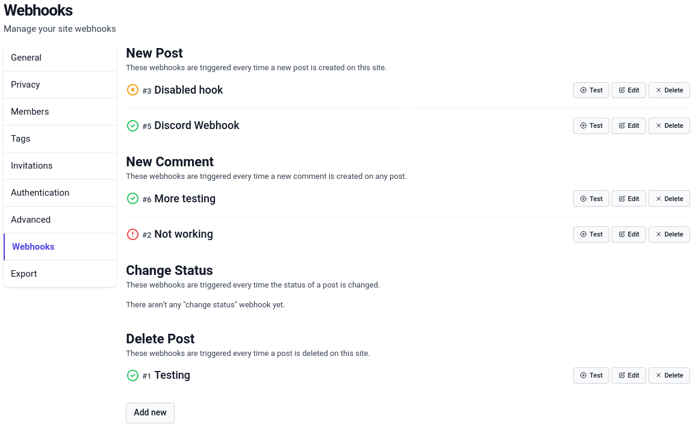
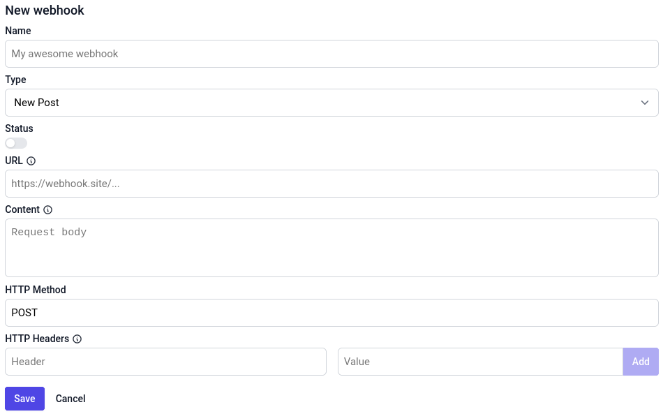
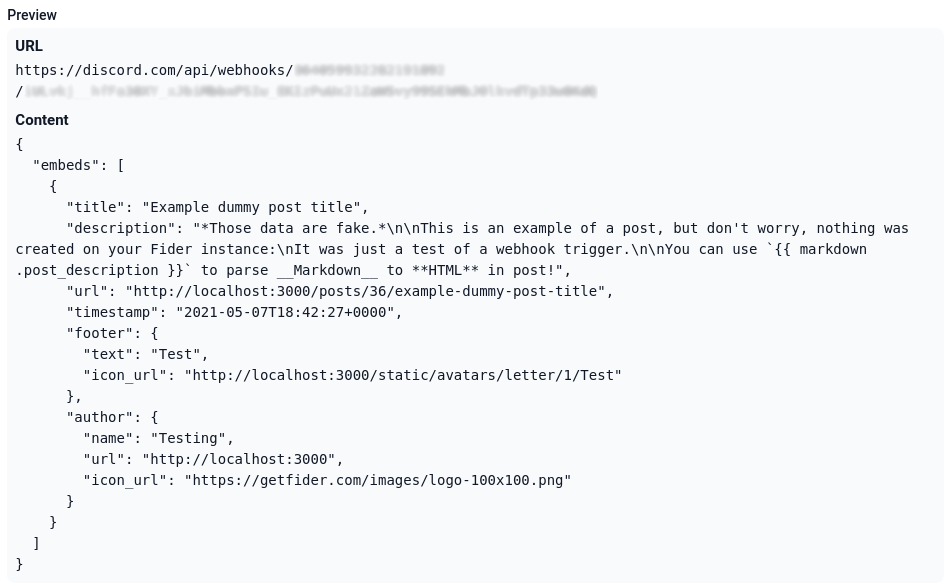
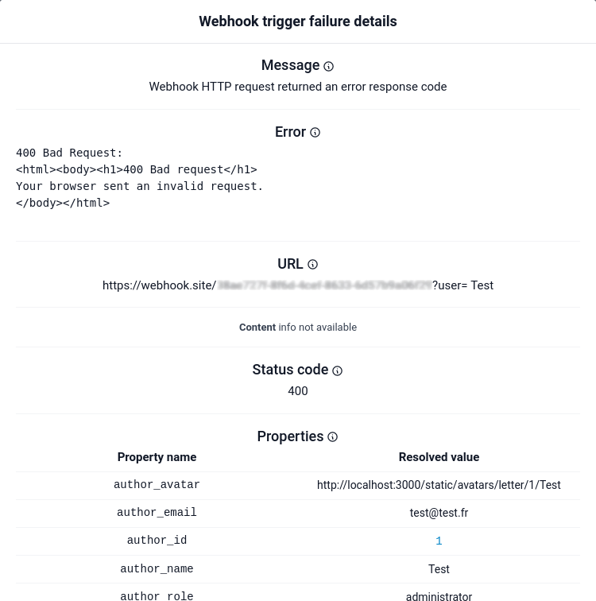

Webhooks are a powerful integration feature that allow you to propagate events from Fider to other applications, such as Slack, Discord, Microsoft Teams or Zapier.

A webhook is an HTTP request that Fider sends when something happens on your site. There are four types of events:

| Type              | Triggered when                                                         |
| ----------------- | ---------------------------------------------------------------------- |
| **New Post**      | A new post is created                                                  |
| **New Comment**   | A new comment is added to a post                                       |
| **Change Status** | A post's status is changed (not when only the response text is edited) |
| **Delete Post**   | A post is deleted                                                      |

Webhooks are highly customizable and you can create as many webhooks as you need for each event type.

### Create a new Webhook

While logged in as an Administrator, navigate to **Site Settings -> Webhooks**.

This page lists all created Webhooks, whether they are Enabled, Disabled or Failed. To create a new one, click **Add new webhook** and fill the form with all the required information as explained on the section below.



### Webhook configuration {#webhook-configuration}

Each Webhook has a name for you to quickly recognize it, a type defining its trigger event, a status so you can enable or disable it, a URL and a content
that can both be formatted using Go templates, an HTTP method used to perform the request and a set of additional HTTP headers.



#### Name

The name is used in the admin control panel to identify the Webhook. It is never shown to users or sent in the request, and it must be less than 60 characters.
It doesn't need to be unique: a unique ID displayed with a `#` symbol is always included with the name so you can distinguish two Webhooks with the same name.

#### Type

The type defines which event triggers this Webhook (see the list at the top of this page). It also defines which [properties](#properties) are available in your templates.

#### Enabled

This toggle defines whether the Webhook is active or not. New Webhooks are enabled by default, but we highly recommend that you disable it and
[test](#webhook-testing) your Webhook before enabling it.

When a Webhook is saved as enabled, Fider checks that the URL and content templates compile and that the URL is allowed (see
[Private network addresses](#private-network-addresses)). These checks are skipped when saving a disabled Webhook.

When a Webhook fails, it is automatically disabled and marked as **Failed** until you edit and fix it (see [When a Webhook fails](#when-a-webhook-fails)).

#### URL

The URL is where the HTTP request is sent. This is usually given by your target application, so refer to its documentation to know how to get one.
See the list of [common Webhook targets](#common-webhook-targets-documentation) for some help with the most popular ones.

The URL can use [Go template formatting](#writing-go-templates) and must start with `http://` or `https://`. By default, it can't point to a private or internal
network address, see [Private network addresses](#private-network-addresses).

#### Content

The content is the body of the HTTP request. In most cases, it will include information about the event that triggered it.
Just like the URL, you can use [Go template formatting](#writing-go-templates) here. Click on the information icon next to the field to open the integrated
help, and check the **Preview** area to see what your request would contain with example data. The content must be less than 10,000 characters.

#### HTTP Method

This is the [HTTP request method](https://developer.mozilla.org/en-US/docs/Web/HTTP/Methods) of the request, `POST` by default. Fider sends whatever method you
type here. In most cases, when sending data in the **Content**, the HTTP method will be `POST`. Check your target application's documentation to be sure.

#### HTTP Headers

You can add any [HTTP headers](https://developer.mozilla.org/en-US/docs/Web/HTTP/Headers) you want here. Each header has a name and a value, and you cannot
define the same header twice. Header values are sent as they are (they are not templates).

Fider doesn't add a `Content-Type` header for you, nor does it sign the request, so add the headers your target application expects. The most common are:

- `Content-Type`: tells your application the MIME type of the data in your **Content**. Common values are: `application/json`, `text/plain`,
  `application/x-www-form-urlencoded`, `application/xml`...
- `Authorization`: authenticates the request with given credentials.

#### Private network addresses {#private-network-addresses}

To protect your network, Fider blocks Webhooks that target private or internal network addresses. This includes `localhost`, loopback addresses
(`127.0.0.1`, `::1`), private ranges (`10.x.x.x`, `172.16.x.x` to `172.31.x.x`, `192.168.x.x`), link-local and cloud metadata addresses (`169.254.x.x`),
and any host name that resolves to one of them, such as another container on the same Docker network.

The URL is checked when you save an enabled Webhook, before each request, and again when the connection is made. A blocked URL fails with the message
_This URL is not allowed because it targets a private or internal network address._

If you self-host Fider and need to send Webhooks to a service on your own network, set the environment variable `ALLOW_PRIVATE_NETWORK_TARGETS=true`
(available since v0.36.1). Only `http` and `https` URLs are allowed either way. This also allows custom OAuth providers to use internal addresses, so only enable it if you trust your administrators. See the
[configuration reference](/hosting-instance#configuration-reference).

Webhook requests are sent directly to the target: `HTTP_PROXY` and `HTTPS_PROXY` are ignored. If your server can only reach
the internet through a proxy, you also need `ALLOW_PRIVATE_NETWORK_TARGETS=true`: with it set, Webhook requests use the proxy settings.

Redirects are never followed. A `3xx` response counts as a success, so make sure the Webhook URL points at the final address.

### Writing Go templates (for your Webhook URL and content) {#writing-go-templates}

#### The preview field

While you edit the URL or the content, a preview is shown below the form, rendered with example data. It refreshes a couple of seconds after you stop typing.
If a template can't be parsed, the preview shows the error instead.



#### Presentation

[Go templates][go-template-doc] are a way to customize a text using external values (also called here "properties"). The engine used here is the
native `text/template` Go package. This is a powerful engine, but creating a basic template is not complicated. You can write text as you want and insert a
property name, prefixed by a dot, enclosed in double braces to place its value. For example, this is the most basic template with some values:

**Template**

```gotemplate
A new post entitled "{{ .post_title }}" has been created by {{ .author_name }}.
```

**Rendered text**

```
A new post entitled "Example dummy post title" has been created by Test.
```

In addition to properties, you can also use "functions", which are really useful to perform operations on values before they get inserted in the text. Example:
_(Read more about time formatting [here][go-time-format])_

**Template**

```gotemplate
The post was created on {{ format "Monday, 02 Jan 2006 at 15:04:05" .post_created_at }}.
```

**Rendered text**

```
The post was created on Friday, 07 May 2021 at 18:42:27.
```

To adapt the content dynamically depending on a property's value, you can even use "control structures", such as conditions and loops!
For example, you may add an element for post tags (also note the use of the minus sign `-` to trim white space):

**Template**

```gotemplate
The post has {{ if len .post_tags -}}
  {{ len .post_tags }} tag {{- if gt (len .post_tags) 1 -}} s {{- end }}:
  {{- range .post_tags }} {{ . }} {{- end -}}
{{- else -}}
  no tag
{{- end }}.
```

**Rendered text**

Post with tags

```
The post has 2 tags: tag1 tag2.
```

Post without tag

```
The post has no tag.
```

When using a function call result as another function's argument, don't forget to wrap the expression in parentheses: `{{ quote (format "15:04:05" .post_created_at) }}`.
You can also use a pipe character (`|`) to chain calls: `{{ .post_created_at | format "15:04:05" | quote }}` or `{{ format "15:04:05" .post_created_at | quote }}`.

Since the double braces are special characters in templates, if you need to insert them in your text, use the following trick: `{{ "{{" }}`. Do not hesitate
to consult the [official Go documentation][go-template-doc] about templates to see what is possible.

#### Security disclaimer

You should always keep in mind user content may be insecure! Post titles and descriptions, comments and user names are free text directly from the users.
You need to properly encode values like that when using them in JSON fields for example. The following example is a **bad** configuration:

```gotemplate
{
  "message": "{{ .post_description }}"
}
```

A malicious user could create a post with this description:

```gotemplate
Hacked!",
"important": true,
"from": "admin
```

When the template will be executed, the final result will look like:

```json
{
  "message": "Hacked!",
  "important": true,
  "from": "admin"
}
```

The targeted application may interpret the `"important": true` as a message requiring a notification and use the `from` field to set the sender. Thus, people
will receive a notification for a message from the admin saying "Hacked!". Pretty scary.

Please avoid this trouble and use the safety functions like `quote`, `escape`, `urlquery`, `stripHtml`...

The correct configuration would be (note the external quotes have been removed too):

```gotemplate
{
  "message": {{ quote .post_description }}
}
```

#### List of properties and functions

You can also find this information in the integrated help by clicking on the information icon next to the **URL** and **Content** fields.

##### Properties {#properties}

The properties available depend on the Webhook type. The example values below are the ones used by the preview and the test button.

These properties are available for **all** Webhook types:

| Property name      | Description                                                    | Example value                                                                                                                                                                    |
| ------------------ | -------------------------------------------------------------- | -------------------------------------------------------------------------------------------------------------------------------------------------------------------------------- |
| `author_id`        | ID of the user who performed the action                        | 1                                                                                                                                                                                |
| `author_name`      | Name of the user who performed the action                      | Test                                                                                                                                                                             |
| `author_email`     | Email of the user who performed the action                     | test@test.fr                                                                                                                                                                     |
| `author_role`      | Role of the user who performed the action                      | administrator                                                                                                                                                                    |
| `author_avatar`    | Avatar URL of the user who performed the action                | https://yourapp.fider.io/static/avatars/letter/1/Test                                                                                                                            |
| `tenant_id`        | ID of your site                                                | 1                                                                                                                                                                                |
| `tenant_name`      | Name of your site                                              | Testing                                                                                                                                                                          |
| `tenant_subdomain` | Subdomain of your site                                         | yourapp                                                                                                                                                                          |
| `tenant_status`    | Status of your site                                            | active                                                                                                                                                                           |
| `tenant_locale`    | Language of your site                                          | fr                                                                                                                                                                               |
| `tenant_url`       | URL of your site                                               | https://yourapp.fider.io                                                                                                                                                         |
| `tenant_logo`      | Logo URL of your site                                          | https://login.fider.io/static/assets/logo.png (the default logo, when you haven't uploaded one)                                                                                  |
| `post_id`          | Internal ID of the post                                        | 36                                                                                                                                                                               |
| `post_number`      | Number of the post, as shown in its URL                        | 36                                                                                                                                                                               |
| `post_title`       | Title of the post                                              | Example dummy post title                                                                                                                                                         |
| `post_slug`        | Slug of the post                                               | example-dummy-post-title                                                                                                                                                         |
| `post_description` | Description of the post, in Markdown                           | \*Those data are fake.\*<br /><br />This is an example of a post, but don't worry, nothing was created on your Fider instance:<br />It was just a test of a webhook trigger. ... |
| `post_created_at`  | Creation date of the post (a time value, use it with `format`) | 2021-05-07T18:42:27Z                                                                                                                                                             |
| `post_url`         | URL of the post                                                | https://yourapp.fider.io/posts/36/example-dummy-post-title                                                                                                                       |

For the **New Post** type, `author_*` is the author of the post.

These properties are available for the **New Comment**, **Change Status** and **Delete Post** types:

| Property name                 | Description                                                      | Example value                                         |
| ----------------------------- | ---------------------------------------------------------------- | ----------------------------------------------------- |
| `post_author_id`              | ID of the author of the post                                     | 7                                                     |
| `post_author_name`            | Name of the author of the post                                   | Fider                                                 |
| `post_author_email`           | Email of the author of the post                                  | contact@fider.io                                      |
| `post_author_role`            | Role of the author of the post                                   | visitor                                               |
| `post_author_avatar`          | Avatar URL of the author of the post                             | https://login.fider.io/static/assets/logo.png         |
| `post_votes`                  | Number of votes                                                  | 7                                                     |
| `post_comments`               | Number of comments                                               | 3                                                     |
| `post_status`                 | Status of the post                                               | started                                               |
| `post_tags`                   | List of the post's tags (use `range` to loop over them)          | [tag1 tag2]                                           |
| `post_response`               | `true` if the post has a response                                | true                                                  |
| `post_response_text`          | Response text, in Markdown (only when `post_response` is `true`) | This is a response, still in \*Markdown\*.            |
| `post_response_responded_at`  | Date of the response (a time value, use it with `format`)        | 2021-07-09T15:29:57Z                                  |
| `post_response_author_id`     | ID of the user who responded                                     | 1                                                     |
| `post_response_author_name`   | Name of the user who responded                                   | Test                                                  |
| `post_response_author_email`  | Email of the user who responded                                  | test@test.fr                                          |
| `post_response_author_role`   | Role of the user who responded                                   | administrator                                         |
| `post_response_author_avatar` | Avatar URL of the user who responded                             | https://yourapp.fider.io/static/avatars/letter/1/Test |

Post status can be `open`, `started`, `planned`, `completed`, `declined`, `duplicate` or `deleted`. User roles can be `visitor`, `collaborator` or `administrator`.

When a post is marked as `duplicate`, these properties describe the original post: `post_response_original_number`, `post_response_original_title`,
`post_response_original_slug`, `post_response_original_status` and `post_response_original_url`.

Additional properties by type:

- **New Comment**: `comment` is the text of the new comment, in Markdown, and `comment_id` is its ID. `author_*` is the author of the comment.
- **Change Status**: `post_old_status` is the status before the change, and `post_status` is the new status. `author_*` is the user who changed it.
- **Delete Post**: `post_status` is `deleted` and `post_response_text` contains the reason given for the deletion, if any. `author_*` is the user who deleted it.

##### Functions

| Function    | Description                                                                                                     | Parameters<br /><small>Type - Description</small>                                          |
| ----------- | --------------------------------------------------------------------------------------------------------------- | ------------------------------------------------------------------------------------------ |
| `stripHtml` | Strip HTML tags from the input data                                                                             | `string` - The input string containing HTML to strip                                       |
| `md5`       | Hash text using [MD5](https://en.wikipedia.org/wiki/MD5) algorithm                                              | `string` - The input string to hash                                                        |
| `lower`     | Lowercase text                                                                                                  | `string` - The input string to lowercase                                                   |
| `upper`     | Uppercase text                                                                                                  | `string` - The input string to uppercase                                                   |
| `markdown`  | Convert [Markdown](https://en.wikipedia.org/wiki/Markdown) to plain text (formatting and HTML tags are removed) | `string` - The input string containing Markdown                                            |
| `format`    | [Format][go-time-format] the given date and time                                                                | `string` - The date format according to Go specifications<hr />`time` - The time to format |
| `quote`     | Enquote a string and escape inner special characters                                                            | `string` - The input string to quote                                                       |
| `escape`    | Escape inner special characters of a string, without enquoting it                                               | `string` - The input string to escape                                                      |
| `urlquery`  | Encode a string into a valid URL query element                                                                  | `string` - The input string to encode as URL query value                                   |
| `truncate`  | Truncate a string to the given length, ending it with `...` when it was longer                                  | `string` - The input string to truncate<hr />`number` - Maximum length of the output       |

The [built-in Go template functions](https://pkg.go.dev/text/template#hdr-Functions), such as `len`, `printf`, `eq` or `index`, are also available.

Don't forget to use the **Preview** field to help you experiment with these functions!

### Testing {#webhook-testing}

Before enabling any Webhook on Fider, we highly recommend that you keep it disabled and use the **Test** button to confirm it's working properly.

The **Test** button is shown next to each Webhook in the list, whether it is enabled or not. When clicked, an event of the appropriate type is simulated
with example data (you are the author, and the post is a fake one; nothing is created on your site), and only this Webhook is triggered.
A notification in the upper-right corner of the screen indicates the result. Once you're happy with the configuration, you can enable it and it will be
triggered automatically with real properties every time the selected event occurs.

The result can be either a success: the HTTP request was sent and the response status code was below 400; or a failure: something went wrong during the process.
In case of a success, check your target application to confirm everything is OK, then you can enable your Webhook.
If it was a failure, a report is available by clicking on the information icon next to your Webhook's name. See the
[Webhook trigger failure report](#webhook-trigger-failure-report) below.

Note that a failed test counts as a failure: the Webhook is marked as **Failed** (see below).

### When a Webhook fails {#when-a-webhook-fails}

A Webhook fails when one of its templates can't be rendered, when its URL is not allowed, when the HTTP request can't be sent, or when the target responds
with a status code of 400 or above. This applies both to real events and to tests.

By default, a failed Webhook is automatically disabled and marked as **Failed**, so it won't be triggered again until you fix it. To re-enable it, edit the
Webhook, switch the **Enabled** toggle on and save. Saving a failed Webhook without switching it on keeps it disabled.

Self-hosted instances can keep failing Webhooks enabled by setting the environment variable `WEBHOOK_DISABLE_ON_FAILURE=false` (it is `true` by default).
Failures are always written to the server logs. See the [configuration reference](/hosting-instance#configuration-reference).

The detailed failure report is only shown in the admin panel after a test. Failures of real events are only visible in the server logs and through the
**Failed** status.

### Webhook trigger failure report {#webhook-trigger-failure-report}

This report is shown when a test of a Webhook goes wrong. It means your configuration is incorrect and you should not enable this Webhook yet.
It is a good practice to always test a Webhook after each edit to ensure nothing was broken.



#### Understanding the report

There is a lot of information included in the report and it may be disconcerting the first time you see it.

First, the **Message** indicates where the process was interrupted, and why. Then, the **Error** shows what went wrong and caused the trigger process to stop.
**URL** and **Content** are the parsed templates replaced with properties' values, helping you to understand the performed request.
The **Status code** is the [HTTP response status code](https://developer.mozilla.org/en-US/docs/Web/HTTP/Status) returned by the request.
**Properties** are all the variables you can use in templates, with their resolved values.

#### Analyzing the message and error

Five error **messages** are possible:

1. _Could not parse webhook URL template_
2. _Webhook URL targets a blocked address_
3. _Could not parse webhook content template_
4. _Could not execute webhook HTTP request_
5. _Webhook HTTP request returned an error response code_

For each of these messages, the **error** field will bring more precise information about:

1. What was wrong in the **URL** template
2. Why the rendered **URL** is not allowed (not a valid `http`/`https` URL, a host name that can't be resolved, or a private or internal network address)
3. What was wrong in the **Content** template
4. What prevented the HTTP request from being executed
5. What the server responded to the request (status code and response body)

#### Solving problems

In case of **1.** or **3.**, you should verify your templates and do not hesitate to take advantage of the **Preview** area in the Webhook form.
See [Writing Go templates](#writing-go-templates) for more information.

In case of **2.**, check the URL shown in the report. If it targets a service on your own network on purpose, see
[Private network addresses](#private-network-addresses).

Regarding **4.**, it becomes more subtle. If anything fails, from sending the request to reading the response, it will be this error.
First of all, check the URL for a spelling mistake in your app's domain name.
Also, try pasting this URL in your browser to see if the target application is alive.
On your application, be sure to reply and properly close the HTTP connection after handling the Webhook.
If your Fider server is on an internal network, ensure it can send requests to your application (remember that proxy settings are ignored by default).
An error mentioning _connection to a private or internal network address is not allowed_ means the host name resolved to a blocked address when the
request was made.

Finally, concerning **5.**, the request was correctly sent to your application, but it was rejected. This can be caused by an invalid **URL**,
an inappropriate **content**, or a missing **HTTP header**. Please refer to your application's official documentation and try to start with a
basic example (sending `Hello World` is a good way to begin your debugging session).

A special case of failure could be the malformation of the result produced by templates with some values.
Here are some recommendations about this:

- Properties passed as GET parameters in the URL query (i.e. after the `?`) should always be encoded using `urlquery`.
  ```gotemplate
  https://example.org/webhook/fider?author={{ urlquery .author_name }}
  ```
- When using a structured text format such as JSON, or any other format asking you to enquote an element, you should use the `quote` function.
  ```gotemplate
  {
    "title": {{ quote .post_title }}
  }
  ```

When you think your problem has been solved, don't forget to [test](#webhook-testing) your Webhook before enabling it!

### Common Webhook targets documentation {#common-webhook-targets-documentation}

- Slack: [Generic Webhook documentation](https://slack.com/help/articles/115005265063-Incoming-webhooks-for-Slack), [Create the Webhook](https://api.slack.com/messaging/webhooks), [Webhook messages format](https://api.slack.com/messaging/composing)
- Discord: [Create the Webhook](https://support.discord.com/hc/en-us/articles/228383668-Intro-to-Webhooks), [Webhook messages format](https://discord.com/developers/docs/resources/webhook)
- Microsoft Teams: [Create the Webhook](https://docs.microsoft.com/en-us/microsoftteams/platform/webhooks-and-connectors/how-to/add-incoming-webhook), [Webhook messages format](https://docs.microsoft.com/en-us/microsoftteams/platform/webhooks-and-connectors/how-to/connectors-using?tabs=cURL)

[go-template-doc]: https://pkg.go.dev/text/template
[go-time-format]: https://yourbasic.org/golang/format-parse-string-time-date-example/#standard-time-and-date-formats
