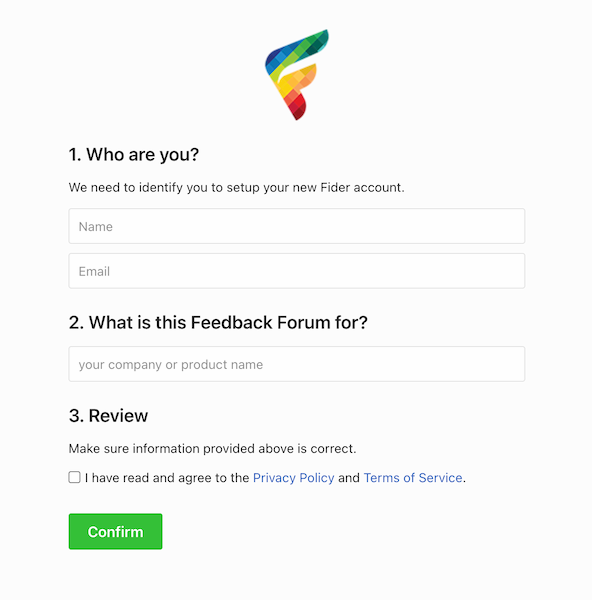

import CloudInstance from "./_markdown-cloud-instance.mdx";

<CloudInstance />

### Prerequisites

##### Docker [https://docs.docker.com/engine/install](https://docs.docker.com/engine/install)

As we don't distribute Linux or Windows specific binaries, Docker is a must to host Fider. It provides a consistent runtime environment and is widely supported by many cloud providers. You can run it standalone or in a container orchestration.

##### Docker Compose [https://docs.docker.com/compose/install](https://docs.docker.com/compose/install)

This installation guide uses Docker Compose to simplify the setup of containers.

##### PostgreSQL 12+ Database

Fider requires PostgreSQL 12+. This guide uses Postgres inside a container for simplicity, but it's possible to install it on the host virtual machine or a different machine.

##### E-mail Sender

You can choose between an **SMTP Server** or a **[Mailgun](https://www.mailgun.com)** account.

### Installing and Running

##### Step 1: Create a docker compose file

Create a `/var/fider` folder and copy content below into a file `/var/fider/docker-compose.yml`. Read the inline comments to know what each setting is used for and modify them appropriately.

```
services:
  db:
    restart: always
    image: postgres:17
    volumes:
      - /var/fider/pg_data:/var/lib/postgresql/data
    environment:
      POSTGRES_USER: fider
      POSTGRES_PASSWORD: s0m3g00dp4ssw0rd
  app:
    restart: always
    image: getfider/fider:stable
    ports:
      - "80:3000"
    environment:
      # Public Host Name
      BASE_URL: http://localhost

      # Connection string to the PostgreSQL database
      DATABASE_URL: postgres://fider:s0m3g00dp4ssw0rd@db:5432/fider?sslmode=disable

      # Generate a secure secret, for example using https://jwtsecrets.com
      JWT_SECRET: VERY_STRONG_SECRET_SHOULD_BE_USED_HERE

      # From which account e-mails will be sent
      EMAIL_NOREPLY: noreply@yourdomain.com

      ###
      # EMAIL
      # Either EMAIL_MAILGUN_* or EMAIL_SMTP_* or EMAIL_AWSSES_* is required
      ###

      # EMAIL_MAILGUN_API: key-yourkeygoeshere
      # EMAIL_MAILGUN_DOMAIN: yourdomain.com
      # EMAIL_MAILGUN_REGION: US

      # EMAIL_SMTP_HOST: smtp.yourdomain.com
      # EMAIL_SMTP_PORT: 587
      # EMAIL_SMTP_USERNAME: user@yourdomain.com
      # EMAIL_SMTP_PASSWORD: s0m3p4ssw0rd
      # EMAIL_SMTP_ENABLE_STARTTLS: 'true'

      # EMAIL_AWSSES_REGION: us-east-1
      # EMAIL_AWSSES_ACCESS_KEY_ID: youraccesskeygoeshere
      # EMAIL_AWSSES_SECRET_ACCESS_KEY: yoursecretkeygoeshere
```

Pay close attention to the BASE_URL field; ensure it is set to the correct public URL with the appropriate protocol (http or https).

The Docker Compose file above defines two services: `db` and `app`. In case you're using an external Postgres database, remove the db service and replace `DATABASE_URL` environment variable with your connection string.

For multiple feedback boards on one deployment, see [Multi-Tenant Hosting](/multi-tenant).

##### Step 2: Pull the images and run them

Open your favorite terminal, navigate to `/var/fider` and run

```
docker compose pull
docker compose up -d
```

> **Important!** If you see messages like `Error: dial tcp <ip-address>:5432: connect: connection refused`. Don't panic, that's expected when using PostgreSQL in Docker. That happens when the application starts while the database is still starting.

You can find the logs by using `docker compose logs app`. The message `http server started on :3000` means everything is ok and you're ready to go.

Just open your favorite browser and navigate to [http://localhost](http://localhost). You should see a page like the following.



### Use a testing SMTP server

You need a valid SMTP server to start the application, or you will see `panic: could not find environment variable named 'EMAIL_SMTP_HOST'` errors.

If you don't have one and just want to test, you can use [MailHog](https://github.com/mailhog/MailHog). Add a new service to your docker-compose.yml, and configure it:

```patch
  app:
    environment:
      # use this EMAIL config:
      EMAIL_SMTP_HOST: mailhog
      EMAIL_SMTP_PORT: 1025

  # add this service:
  mailhog:
    image: mailhog/mailhog
    restart: always
    ports:
      - "8025:8025"
```

Then restart docker compose. You can now browse to [http://localhost:8025](http://localhost:8025) and read mails sent by fider, especially the sign-in link.

### Secure Fider with HTTPS

When exposing Fider to the internet, it's strongly recommended to setup HTTPS. Take a look at [How to enable TLS/SSL](/how-to-enable-ssl) to learn multiple ways on how to do that.

### F.A.Q.

##### I have submitted the installation form, but I haven't got any confirmation email

Ok so obvious things first - check your spam folders, in case it's gone there. If it's not there, check your fider logs for any sign of errors. It's likely something is wrong with your email configuration.

Once you've sorted your email config, in Fider you can resend the code to continue.

If however it's all looking a bit pear shaped and you want to reset everything and start again, the easiest way to do that is to blitz your tenant from the database with this SQL:

`TRUNCATE TABLE tenants RESTART IDENTITY CASCADE;`.

:::danger
This SQL command will permanently delete your tenant and all associated data, including users, posts, votes, and comments. This action cannot be undone. Only use this if you want to completely reset your Fider instance.
:::
