import CloudIstance from './_markdown-cloud-instance.mdx'

<CloudIstance />

### Prerequisites

##### An [AWS](https://aws.amazon.com/console/) subscription

AWS offers a 12-month [free tier](https://aws.amazon.com/free/?all-free-tier.sort-by=item.additionalFields.SortRank&all-free-tier.sort-order=asc&awsf.Free%20Tier%20Types=*all&awsf.Free%20Tier%20Categories=*all) across many services, after which you'll be billed on a pay-as-you-go basis based on your usage.


##### E-mail Sender

You can choose between a **SMTP Server** or a **[Mailgun](https://www.mailgun.com)** account or an **[SES](https://aws.amazon.com/ses/)** account.


### Deploying your instance

##### Step 1: Create a new PostgreSQL Database

Using the AWS console, create a new instance of **Amazon RDS for PostgreSQL** by following the [Official Guide](https://docs.aws.amazon.com/AmazonRDS/latest/UserGuide/CHAP_PostgreSQL.html).

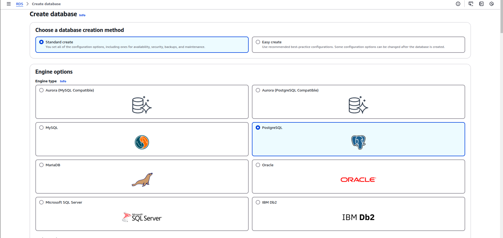

You can also create a database named `fider` 

```
CREATE DATABASE fider;
```
or just do it from the console while creating the database.

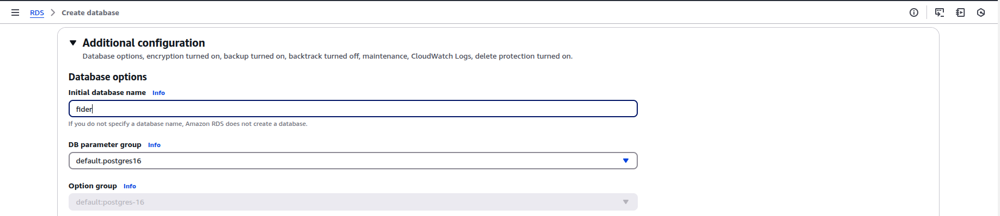

Create a DB subnet group for RDS under the subnet groups tab

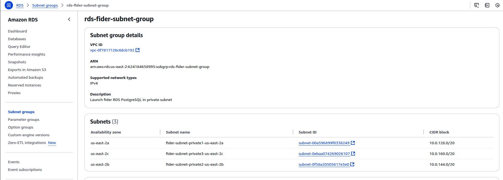

Select the VPC you created for Fider and associate its private subnets. This configuration will launch your RDS instance within a private subnet.

Choose _production_ as the template in the Template section, and select _Single-AZ DB Instance Deployment_ in the Deployment Options. You may also customize these settings.

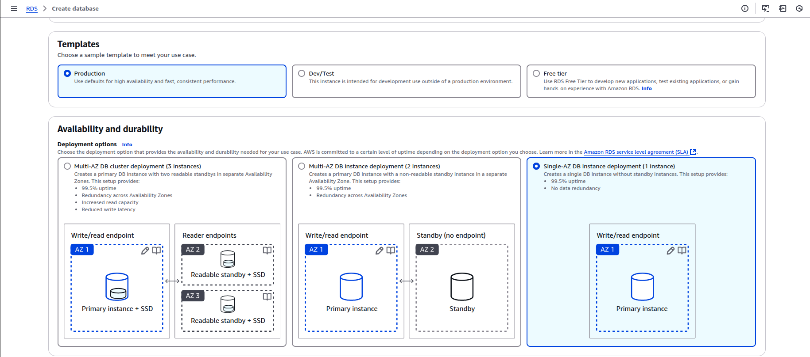

Name your database instance as _fider-database_ and under credentials settings provide the _Master username_ and choose _self managed_ under the credentials management.

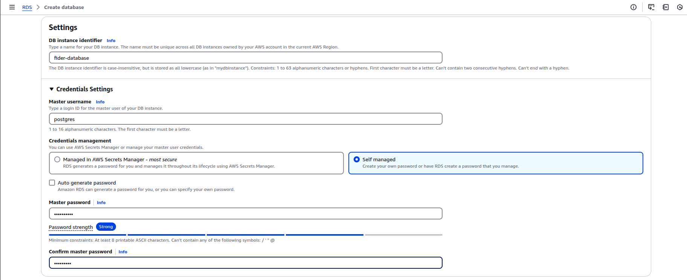

Under the connectivity settings choose the VPC you created for Fider, the subnet group which you created for RDS and set the public access to **No**

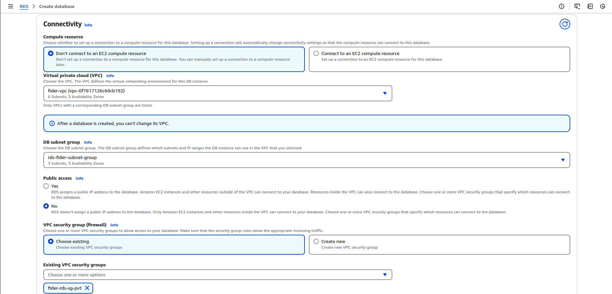

Create a securty group for RDS PostgreSQL, open the port 5432 and choose the source ip as Apprunner's security group and choose the same security group under connectivity settings.

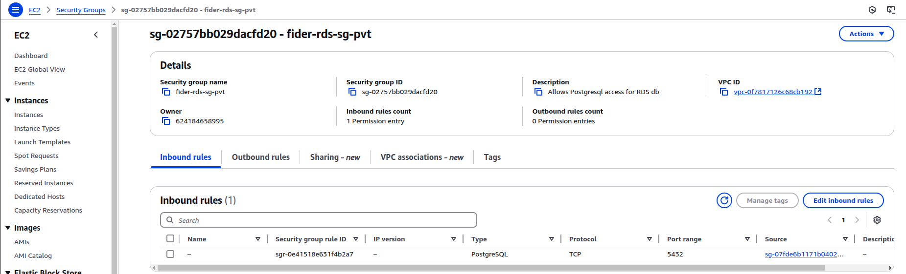

Under database authentication settings choose _Password authentication_.

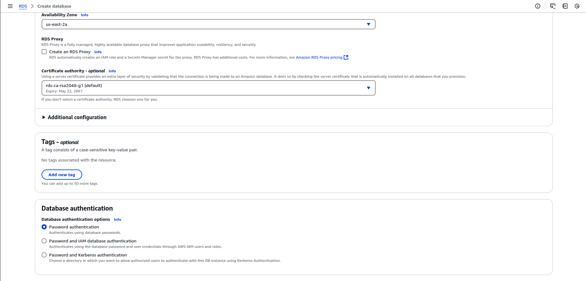

Once done review your database settings and click on **create database**.

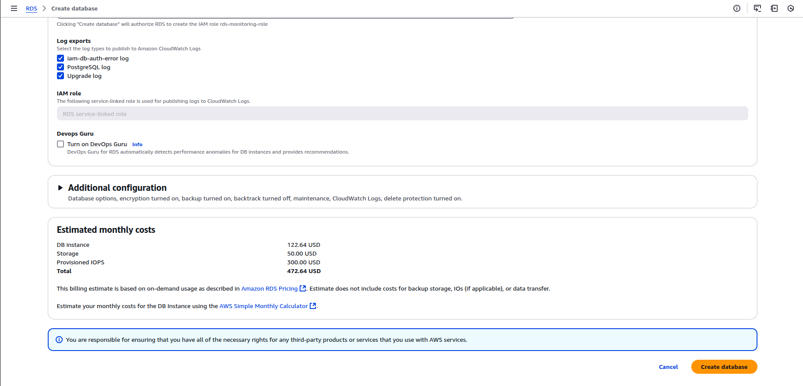

Make sure to note the hostname (endpoint), username and password.

##### Step 2: Containerize Fider and Push to Amazon ECR

1. **Clone the Repository and Build the Docker Image:**  
   Clone the [Fider](https://github.com/getfider/fider) repository and build your Docker image as usual.

2. **Push Your Docker Image to Amazon ECR:**  
   For detailed, step-by-step instructions on how to push your Docker image to Amazon ECR, please refer to the [Amazon ECR Documentation](https://docs.aws.amazon.com/AmazonECR/latest/userguide/what-is-ecr.html).

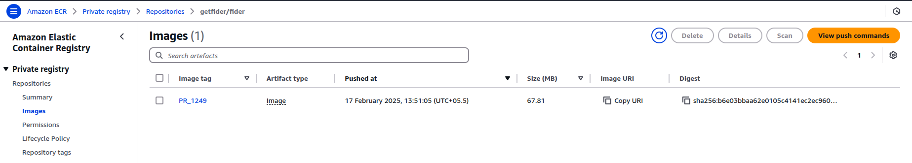

##### Step 3: Create an AWS AppRunner service

**AWS App Runner** is where the application will be hosted. Using the AWS console, search for **App Runner** and create a new service. You will need to have your Fider Docker image in a container registry (Amazon ECR).

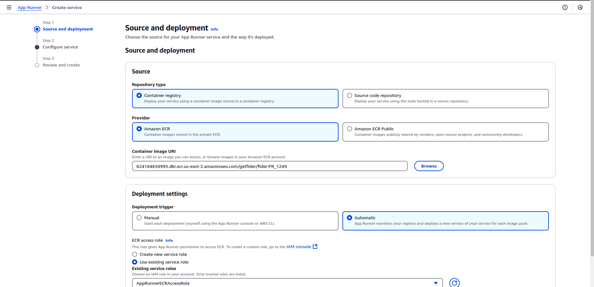

For most cases, a basic configuration works, but if you’re expecting higher traffic, you can select a compute configuration with more vCPU and memory.

##### Step 4: Configure your AppRunner Service

In **App Runner**, go to **Configure service** and add the following environment variables:

- `DATABASE_URL`: `postgresql://{DB_USERNAME}:{DB_PASSWORD}@{RDS_ENDPOINT}:5432/fider?sslmode=require`
- `BASE_URL`: The public URL for your App Runner service (https://service-id.awsapprunner.com) or a custom domain if you choose to go with that.
- `JWT_SECRET`: A secret key used for authentication tokens. You can generate one using an online tool such as [this one](https://www.allkeysgenerator.com/Random/Security-Encryption-Key-Generator.aspx) (at least 512-bit is recommended).
- `EMAIL_NOREPLY`: Set this variable to a no-reply address for your instance.
- `EMAIL_MAILGUN_API`: Your Mailgun API key.
- `EMAIL_MAILGUN_DOMAIN`: Your Mailgun domain.

Check out the environment variables that are supported by Fider [here](https://github.com/getfider/fider/blob/49128a57113c065edc6068bf568926a066c463e5/.example.env#L4)

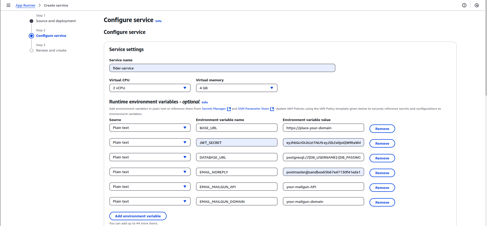

**If you're using plain SMTP to send emails**, you need to replace `MAILGUN_*` variables by the equivalent SMTP variables: `EMAIL_SMTP_HOST`, `EMAIL_SMTP_PORT`, `EMAIL_SMTP_USERNAME`,`EMAIL_SMTP_PASSWORD`.

Under the **Network Settings** section, choose:
- **Public endpoint** in order for your service to be accessible over the internet. 
- **Custom VPC** since RDS PostgreSQL is deployed in private subnet and is not publicly accessible.
  


Click on _Add new_ to create a VPC connector.


Before this create a security group for Apprunner, since it needs a route to reach the RDS in private subnet.

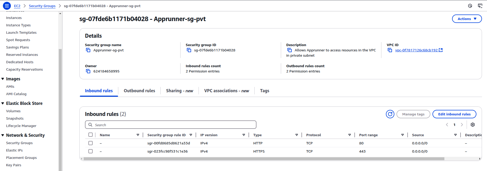

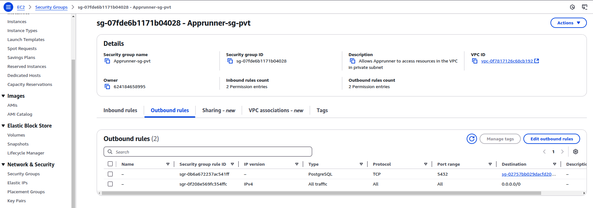

Now, reference the above security group you created in the VPC Connector and choose one or more private subnets from the dropdown.
     
For more details on customizing VPC settings for AWS App Runner, refer to the [AWS App Runner VPC Connector Documentation](https://docs.aws.amazon.com/apprunner/latest/dg/configuring-vpc-connector.html).

##### Step 5: Review configuration and deploy application

Review the configuration paremeters in the final step, save and deploy your service. App Runner will pull your container image from ECR and start the application. If you need a custom domain for hosting your application on App runner, then choose the **custom domain** tab and configure it.

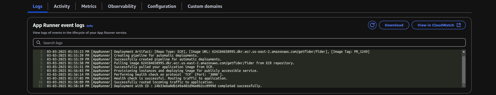

It might take a few seconds for the service to get created and load all new settings.Once that's done, open https://service-id.awsapprunner.com and viola! you should see the signup screen.

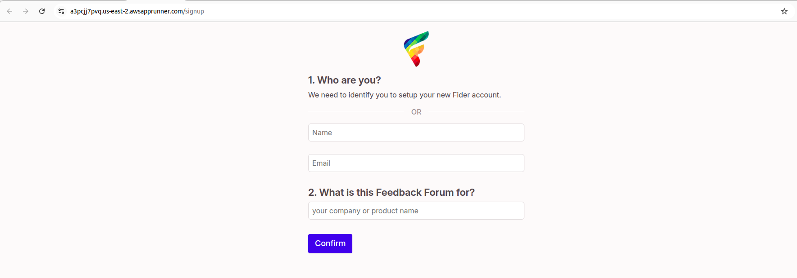

If you are looking for a production grade deployment on AWS, check out this guide on https://dev.to/ittrident/deploying-fider-on-aws-ecs-a-step-by-step-guide-to-deploy-a-feedback-platform-jl4
