import CloudIstance from './_markdown-cloud-instance.mdx'

<CloudIstance />

:::warning

AWS App Runner, used in this guide, [is no longer open to new customers](https://docs.aws.amazon.com/apprunner/latest/dg/apprunner-availability-change.html). If your AWS account doesn't already use App Runner, run the same container image with another service such as Amazon ECS instead. The database, image and environment variable steps below still apply.

:::

### Prerequisites

##### An [AWS](https://aws.amazon.com/console/) subscription

AWS offers a [free tier](https://aws.amazon.com/free/) for new accounts, after which you'll be billed on a pay-as-you-go basis based on your usage.

##### A VPC for Fider

This guide keeps the database in private subnets, so you need a VPC with at least one private subnet.

##### E-mail Sender

Fider cannot start without an email provider. You can choose between an **SMTP Server**, a **[Mailgun](https://www.mailgun.com)** account or **[Amazon SES](https://aws.amazon.com/ses/)**.

### Deploying your instance

##### Step 1: Create a new PostgreSQL Database

Using the AWS console, create a new instance of **Amazon RDS for PostgreSQL** by following the [Official Guide](https://docs.aws.amazon.com/AmazonRDS/latest/UserGuide/CHAP_PostgreSQL.html). Fider requires PostgreSQL 12 or later.

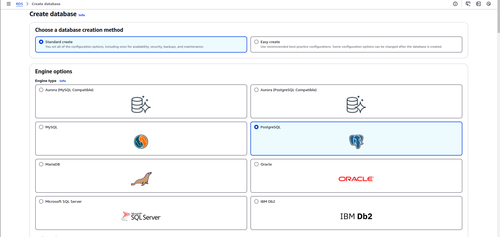

You can also create a database named `fider` 

```
CREATE DATABASE fider;
```
or just do it from the console while creating the database.

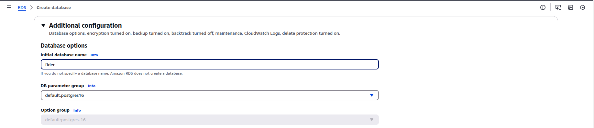

Create a DB subnet group for RDS under the subnet groups tab

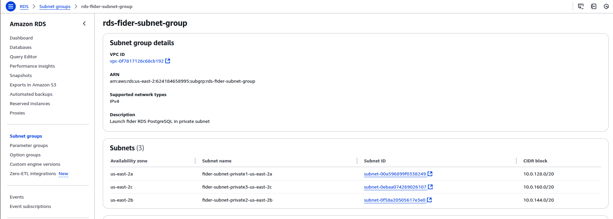

Select the VPC you created for Fider and associate its private subnets. This configuration will launch your RDS instance within a private subnet.

Choose _production_ as the template in the Template section, and select _Single-AZ DB Instance Deployment_ in the Deployment Options. You may also customize these settings.

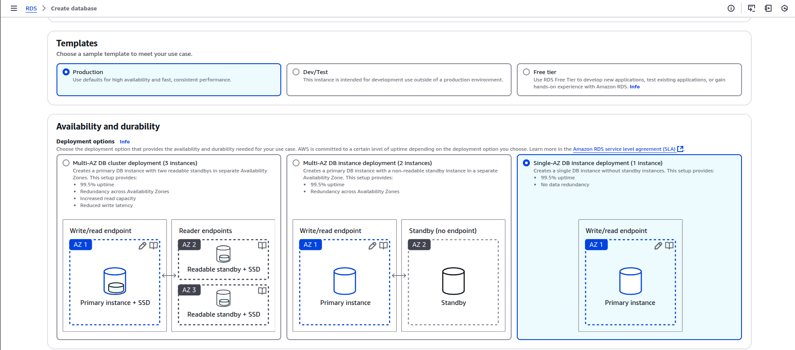

Name your database instance as _fider-database_ and under credentials settings provide the _Master username_ and choose _self managed_ under the credentials management.

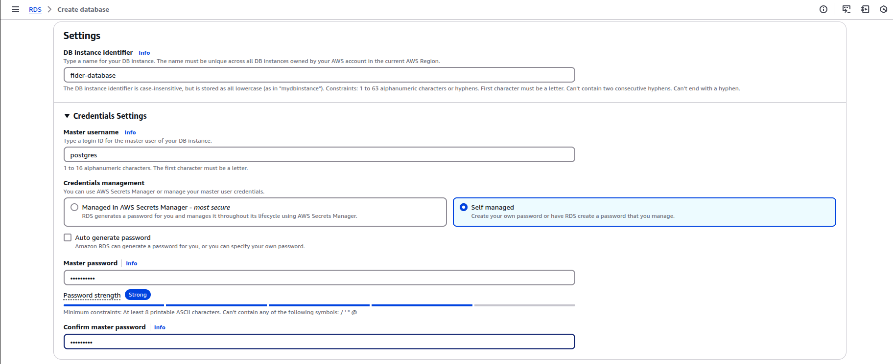

Under the connectivity settings choose the VPC you created for Fider, the subnet group which you created for RDS and set the public access to **No**

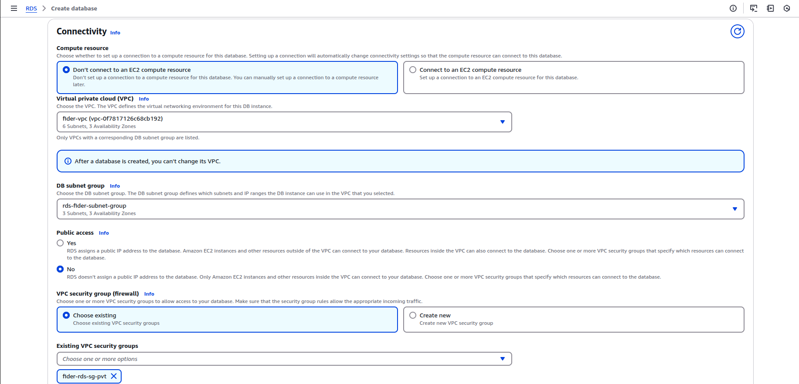

Create a security group for RDS PostgreSQL, open the port 5432 and choose the source as App Runner's security group (created in Step 4), and choose the same security group under connectivity settings.

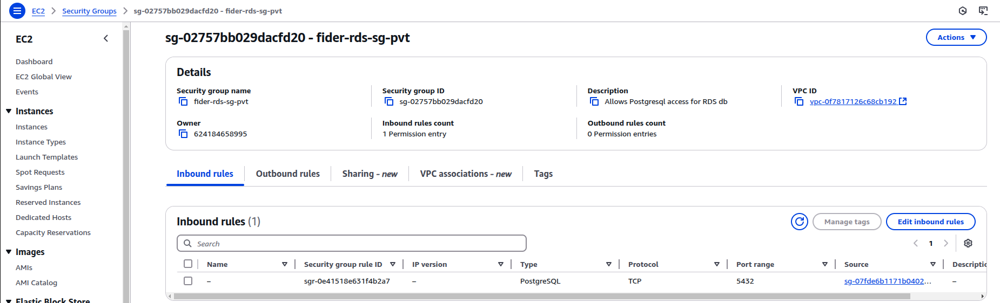

Under database authentication settings choose _Password authentication_.

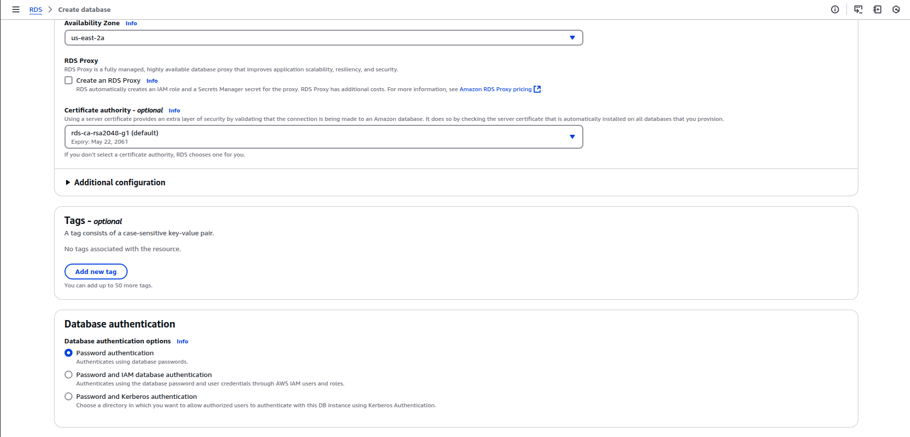

Once done review your database settings and click on **create database**.

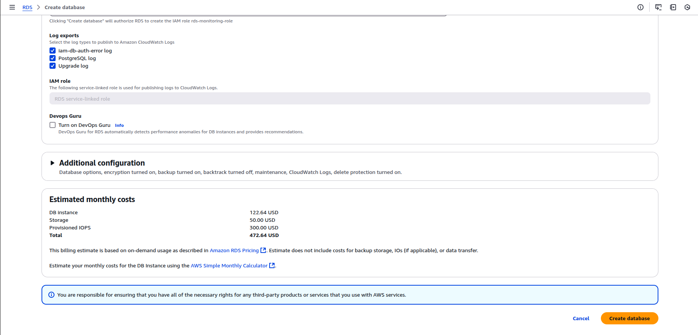

Make sure to note the hostname (endpoint), username and password.

##### Step 2: Push the Fider image to Amazon ECR

App Runner deploys images from Amazon ECR, so copy the official `getfider/fider:stable` image into an ECR repository in your account. You don't need to build Fider yourself.

Create a private repository named `fider` in ECR, then run the following, replacing the account ID and region with your own:

```
aws ecr get-login-password --region us-east-1 | docker login --username AWS --password-stdin 123456789012.dkr.ecr.us-east-1.amazonaws.com
docker pull --platform linux/amd64 getfider/fider:stable
docker tag getfider/fider:stable 123456789012.dkr.ecr.us-east-1.amazonaws.com/fider:stable
docker push 123456789012.dkr.ecr.us-east-1.amazonaws.com/fider:stable
```

To update Fider later, repeat these commands and deploy your App Runner service again. See the [Amazon ECR Documentation](https://docs.aws.amazon.com/AmazonECR/latest/userguide/what-is-ecr.html) for more details.

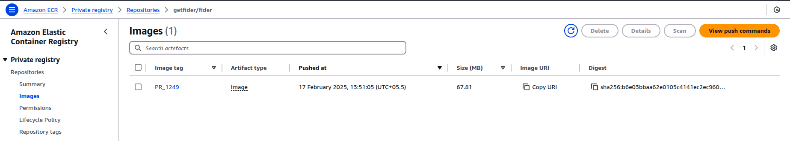

##### Step 3: Create an AWS App Runner service

**AWS App Runner** is where the application will be hosted. Using the AWS console, search for **App Runner** and create a new service using the image you pushed to ECR.

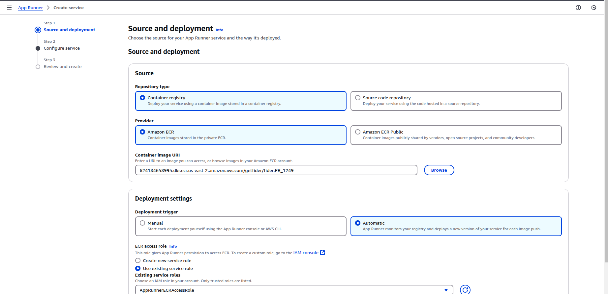

For most cases, a basic configuration works, but if you're expecting higher traffic, you can select a compute configuration with more vCPU and memory.

##### Step 4: Configure your App Runner Service

In **App Runner**, go to **Configure service**. Set the **Port** to `3000`, which is the port Fider listens on. App Runner uses `8080` by default, and the service won't start if the port doesn't match.

Add the following environment variables:

- `DATABASE_URL`: `postgres://{DB_USERNAME}:{DB_PASSWORD}@{RDS_ENDPOINT}:5432/fider?sslmode=require`
- `BASE_URL`: The public URL of your App Runner service (`https://service-id.awsapprunner.com`), or your custom domain if you choose to use one. It must start with `https://`.
- `JWT_SECRET`: A secret key used to sign login sessions. Use a long random value, for example from [jwtsecrets.com](https://jwtsecrets.com).
- `EMAIL_NOREPLY`: A no-reply address that emails are sent from.
- `EMAIL_MAILGUN_API`: Your Mailgun API key.
- `EMAIL_MAILGUN_DOMAIN`: Your Mailgun domain.

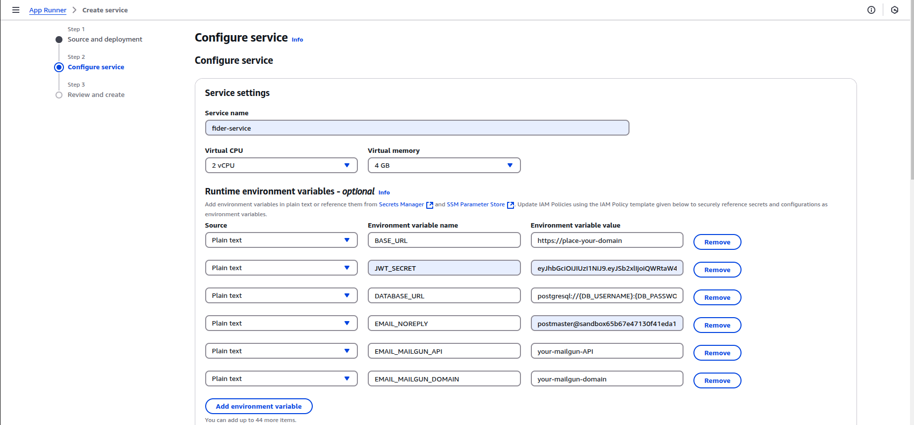

**If you're using Amazon SES**, replace the `EMAIL_MAILGUN_*` variables with `EMAIL_AWSSES_REGION`, `EMAIL_AWSSES_ACCESS_KEY_ID` and `EMAIL_AWSSES_SECRET_ACCESS_KEY`. **If you're using SMTP**, replace them with `EMAIL_SMTP_HOST`, `EMAIL_SMTP_PORT`, `EMAIL_SMTP_USERNAME` and `EMAIL_SMTP_PASSWORD`.

See the [configuration reference](/hosting-instance#configuration-reference) for all the environment variables Fider supports.

Under the **Network Settings** section, choose:
- **Public endpoint** in order for your service to be accessible over the internet. 
- **Custom VPC** since RDS PostgreSQL is deployed in private subnet and is not publicly accessible.
  
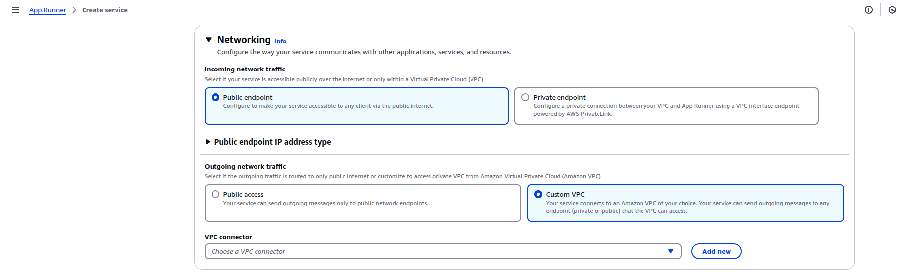

Click on _Add new_ to create a VPC connector.

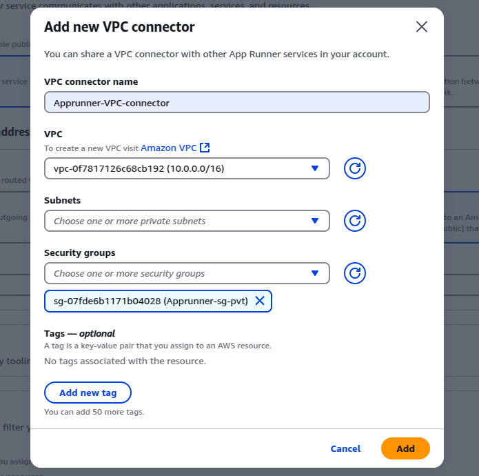

Before this create a security group for App Runner, since it needs a route to reach the RDS in private subnet.

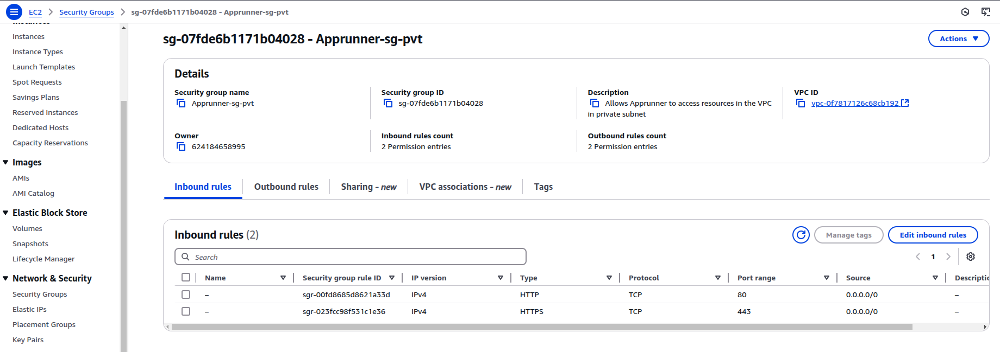

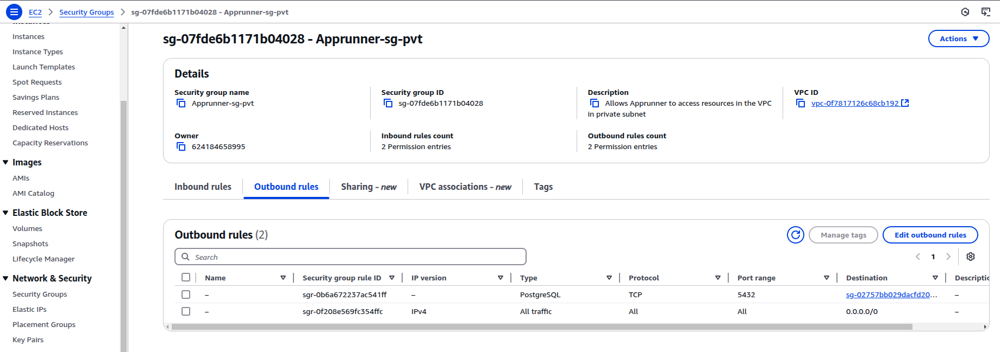

Now, reference the above security group you created in the VPC Connector and choose one or more private subnets from the dropdown.

Once your service uses a VPC connector, its outgoing traffic can only reach the internet through a NAT gateway in your VPC (or, for AWS services such as SES, a VPC endpoint). Fider needs outgoing access to send emails, so make sure the private subnets you choose have one of these.
     
For more details on customizing VPC settings for AWS App Runner, refer to the [AWS App Runner VPC Connector Documentation](https://docs.aws.amazon.com/apprunner/latest/dg/network-vpc.html).

##### Step 5: Review configuration and deploy application

Review the configuration parameters in the final step, save and deploy your service. App Runner will pull your container image from ECR and start the application. Fider creates its database tables automatically when it starts. If you need a custom domain for hosting your application on App Runner, then choose the **custom domain** tab and configure it, and update `BASE_URL` to match.

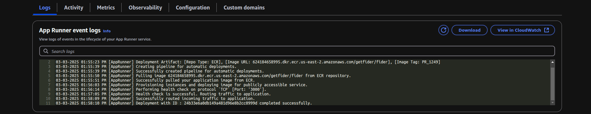

It might take a few seconds for the service to get created and load all new settings. Once that's done, open https://service-id.awsapprunner.com and voilà! You should see the signup screen.

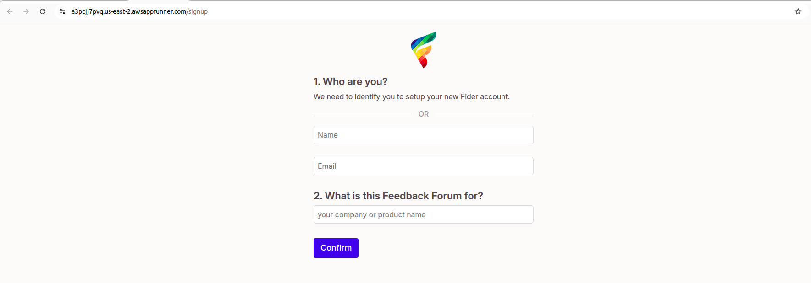

If you are looking for a production grade deployment on AWS, check out this guide on https://dev.to/ittrident/deploy-fider-as-a-private-app-on-aws-with-cloudfront-vpc-origin-1oa6
