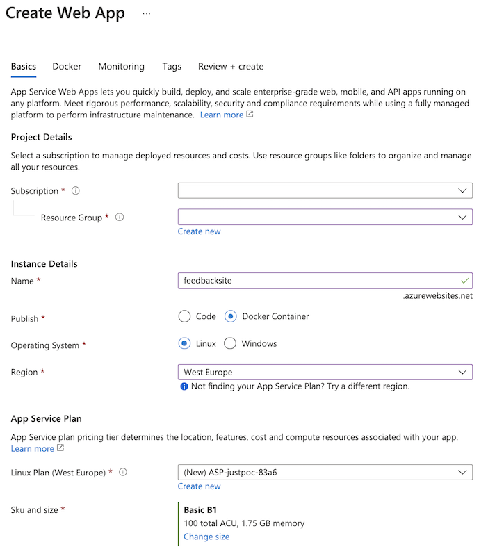
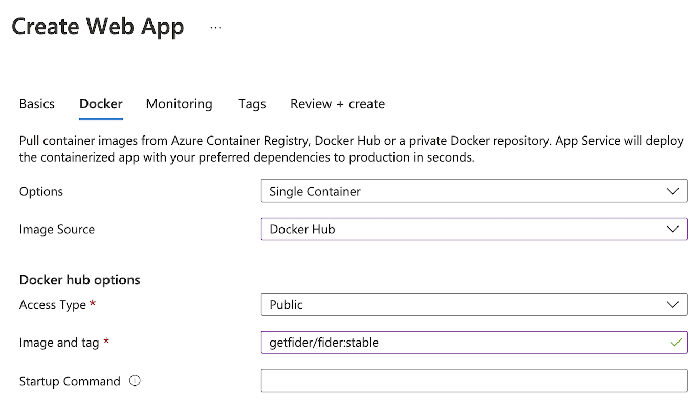
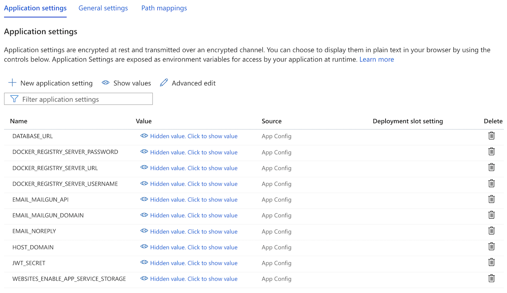

import CloudIstance from './_markdown-cloud-instance.mdx'

<CloudIstance />

### Prerequisites

##### An [Azure](https://azure.microsoft.com/en-us/) subscription

It's free to start, but will require a variable monthly payment afterwards.

##### E-mail Sender

Fider cannot start without an email provider. You can choose between an **SMTP Server**, a **[Mailgun](https://www.mailgun.com)** account or **[Amazon SES](https://aws.amazon.com/ses/)**.

### Deploying your instance

##### Step 1: Create a new PostgreSQL Database

Using Azure portal, create a new **Azure Database for PostgreSQL flexible server** using the [Official Guide](https://learn.microsoft.com/en-us/azure/postgresql/configure-maintain/quickstart-create-server). Fider requires PostgreSQL 12 or later.

The guide above also explains how to configure the firewall so that your App Service can connect, and how to connect with psql. Follow that process and create a database named `fider`.

```
CREATE DATABASE fider;
```

Fider uses the `pg_trgm` extension, and Azure only lets you install extensions that are on its allow list. Before starting Fider, add `PG_TRGM` to the `azure.extensions` server parameter. See [how to allow extensions](https://learn.microsoft.com/en-us/azure/postgresql/extensions/how-to-allow-extensions) for the steps. Without it, Fider fails to start while running its database migrations.

Alternatively, you can also install PostgreSQL on a Virtual Machine.

##### Step 2: Create an Azure App Service

**Azure App Service** (also known as Azure Web App) is where the actual application will be hosted. Using Azure portal again, search for Azure App Service and create a new instance. Publish it as a container on Linux, using the image `getfider/fider:stable` from Docker Hub.

We recommend using Linux and Basic B1 at a minimum, but if you're expecting higher traffic, upgrade to a more suitable tier.




##### Step 3: Configure your App

In your App Service, open the application settings (**Environment variables** in the current Azure portal, **Configuration** in older versions) and add the following:

- `WEBSITES_PORT`: `3000`. This tells App Service which port Fider listens on.
- `DATABASE_URL`: `postgres://{DB_USERNAME}:{DB_PASSWORD}@{POSTGRES_SERVER}.postgres.database.azure.com:5432/fider?sslmode=require`
- `BASE_URL`: `https://{your_appname}.azurewebsites.net`, or your custom domain if you add one. It must start with `https://`.
- `JWT_SECRET`: A secret key used to sign login sessions. Use a long random value, for example from [jwtsecrets.com](https://jwtsecrets.com).
- `EMAIL_NOREPLY`: Set this variable to a no-reply address associated to your instance.
- `EMAIL_MAILGUN_API`: Your Mailgun API key.
- `EMAIL_MAILGUN_DOMAIN`: Set this variable to your Mailgun domain.

If your password contains special characters such as `@`, `:` or `/`, [URL-encode](https://developer.mozilla.org/en-US/docs/Glossary/Percent-encoding) it in `DATABASE_URL`.



**If you're using SMTP**, replace the `EMAIL_MAILGUN_*` variables with `EMAIL_SMTP_HOST`, `EMAIL_SMTP_PORT`, `EMAIL_SMTP_USERNAME` and `EMAIL_SMTP_PASSWORD`. **If you're using Amazon SES**, replace them with `EMAIL_AWSSES_REGION`, `EMAIL_AWSSES_ACCESS_KEY_ID` and `EMAIL_AWSSES_SECRET_ACCESS_KEY`.

See the [configuration reference](/hosting-instance#configuration-reference) for all the environment variables Fider supports.

Save your settings. App Service restarts your app to apply them.

##### Step 4: That's it!

It might take a few seconds for the application to restart and load all the new settings. Once that's done, open `https://{your_appname}.azurewebsites.net` and you should see the signup screen to create your Administrator account, and you can enjoy your Fider instance and share it with your users.


